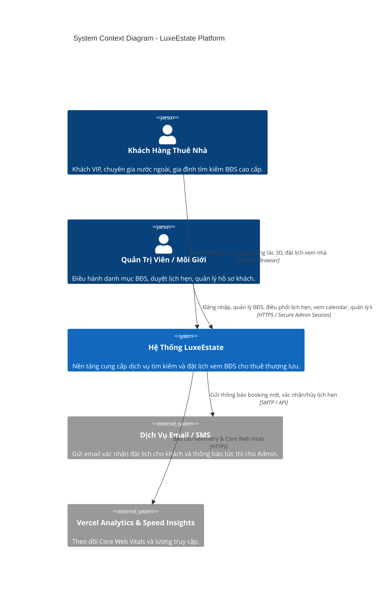
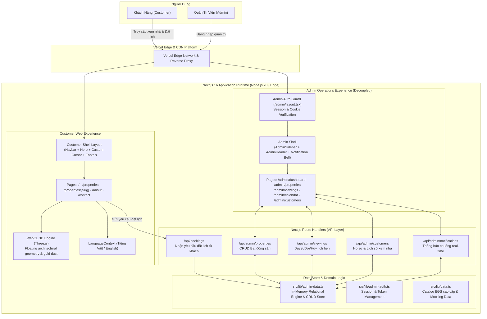

# 01 — Kiến Trúc Hệ Thống (System Architecture & Technical Design)

Tài liệu này mô tả chi tiết kiến trúc tổng thể, mô hình C4 (Context, Container, Component), chiến lược phân tách phân hệ (Decoupling Architecture) và các quyết định kỹ thuật cốt lõi của nền tảng **LuxeEstate**.

---

## 1. Nguyên Tắc Thiết Kế Cốt Lõi (Architecture Principles)

1. **High Cohesion & Clear Separation of Concerns (Tách bạch trải nghiệm):**
   * **Phân hệ Khách Hàng (Customer Portal):** Trải nghiệm thị giác đỉnh cao (*Cinematic, 3D WebGL Three.js, Framer Motion, Lenis Smooth Scroll, Magnetic Cursor, Dual-Language*).
   * **Phân hệ Quản Trị (Admin Portal):** Tốc độ phản hồi tức thì, cấu trúc giao diện sạch sẽ, tập trung vào 3 nghiệp vụ chính: **Quản lý Bất động sản, Quản lý Lịch hẹn & Quản lý Khách hàng**. Hoàn toàn không bị ảnh hưởng bởi Canvas 3D hoặc Cursor animations.
2. **Server-Driven & Modern Next.js Paradigms:**
   * Sử dụng Next.js 16 với **Turbopack Compiler**, React 19 Server Components cho các trang nội dung tĩnh/động để tối ưu SEO và thời gian phản hồi đầu trang (TTFB).
   * Tách biệt ranh giới Client Components (`'use client'`) chỉ khi cần quản lý trạng thái tương tác cục bộ (Bộ lọc tìm kiếm, 3D Canvas, Form nhập liệu, Drawer/Modal).
3. **Data-Store Agnostic & Single Source of Truth:**
   * Khởi đầu với mô-đun lưu trữ trạng thái có cấu trúc rõ ràng (`admin-data.ts`) hỗ trợ đầy đủ các quan hệ Khách Hàng $\leftrightarrow$ Bất Động Sản $\leftrightarrow$ Lịch Hẹn $\leftrightarrow$ Thông Báo.
   * Thiết kế API tuân thủ đúng chuẩn REST, chuẩn bị sẵn sàng cho việc kết nối PostgreSQL / Prisma ORM mà không cần sửa đổi giao diện người dùng.

---

## 2. Mô Hình C4 — System Context (Level 1)



---

## 3. Mô Hình C4 — Container Diagram (Level 2)



---

## 4. Chiến Lược Phân Tách "Hai Phân Hệ" (Decoupling Strategy)

Một trong những thách thức phổ biến của các trang web bất động sản cao cấp là việc tích hợp hiệu ứng thị giác nặng (Canvas WebGL, Custom Cursor, Smooth Scroll) khiến toàn bộ trang quản trị bị chậm, giật lag và gây khó khăn khi thao tác bảng biểu.

LuxeEstate giải quyết vấn đề này bằng cơ chế **Route-Aware Isolation**:

```typescript
// Trích từ src/components/layout/Navbar.tsx & Footer.tsx & CustomCursor.tsx & IntroLoader.tsx
const pathname = usePathname();
const isAdmin = pathname?.startsWith('/admin');

// Nếu đang ở bất kỳ route nào thuộc /admin, hoàn toàn không render các thành phần khách hàng
if (isAdmin) {
  return null;
}
```

### So Sánh Đặc Tính Giữa 2 Phân Hệ

| Tiêu Chí | Phân Hệ Khách Hàng (Customer) | Phân Hệ Quản Trị (Admin Portal) |
| :--- | :--- | :--- |
| **Mục đích chính** | Trải nghiệm ấn tượng, tạo sự tin cậy, thúc đẩy đặt lịch | Tốc độ cao, duyệt lịch nhanh, quản lý chính xác |
| **Bảng màu chủ đạo** | Nền tối sâu thẳm `#0A0A0A`, điểm xuyết vàng kim `#C9A96E` | Nền sáng thanh lịch `#F7F7F5`, thẻ `#FFFFFF`, Sidebar `#111111` |
| **Đồ họa 3D / FX** | Three.js WebGL, hạt bụi phản chiếu, Mesh trôi nổi | **Không sử dụng 3D**, tối giản DOM, tải trang < 50ms |
| **Cuộn trang** | Lenis Smooth Scroll tạo cảm giác lướt êm ái | Cuộn trình duyệt tự nhiên tiêu chuẩn cho dữ liệu bảng biểu lớn |
| **Con trỏ chuột** | Custom Magnetic Cursor có hiệu ứng hào quang vàng | Con trỏ tiêu chuẩn OS nhằm phục vụ việc chọn văn bản, click link chính xác |
| **Đa ngôn ngữ** | Song ngữ tức thì (Tiếng Việt & English) | Giao diện tiếng Việt chuẩn hóa thuật ngữ chuyên ngành BĐS |

---

## 5. Danh Mục Công Nghệ & Lý Do Lựa Chọn (Tech Stack Deep Dive)

### 1. Next.js 16 (App Router) & React 19
* **Turbopack:** Tăng tốc độ biên dịch dự án lên gấp 3-5 lần so với Webpack truyền thống.
* **React 19 Server Components:** Giúp render trước HTML tĩnh cho các trang danh mục, tăng điểm số Lighthouse SEO lên mức tối đa.
* **Asynchronous Dynamic Parameters:** Khắc phục yêu cầu mới của React 19 / Next.js 16 với việc unwrap params bằng hook `use(params)`.

### 2. Tailwind CSS v4 & PostCSS
* Cấu hình CSS-First tinh gọn thông qua tệp `@import "tailwindcss";` kết hợp biến màu `@theme`.
* Không cần tệp cấu hình `tailwind.config.js` phức tạp, tối ưu hóa kích thước gói CSS xuất bản nhỏ hơn 40%.

### 3. Three.js (WebGL Architecture Scene)
* Được đóng gói tại `src/components/3d/Scene3D.tsx`.
* Tự động điều chỉnh số lượng hình học dựa trên độ phân giải màn hình.
* Tự động tạm dừng render khi người dùng cuộn khỏi viewport hoặc chuyển tab để bảo vệ pin và CPU của thiết bị.

### 4. Framer Motion 13
* Sử dụng cho các chuyển động mượt mà: Modal mở lịch xem nhà, hiệu ứng Staggered danh sách BĐS, chuyển tab bộ lọc và thanh tiến trình.

### 5. Playwright CLI Verification Engine
* Kịch bản `scripts/verify-admin.mjs` tích hợp sẵn khả năng giả lập trình duyệt, tự động hóa toàn bộ luồng đăng nhập, chụp ảnh màn hình xác thực 8 trang trọng yếu trong quy trình CI/CD.
