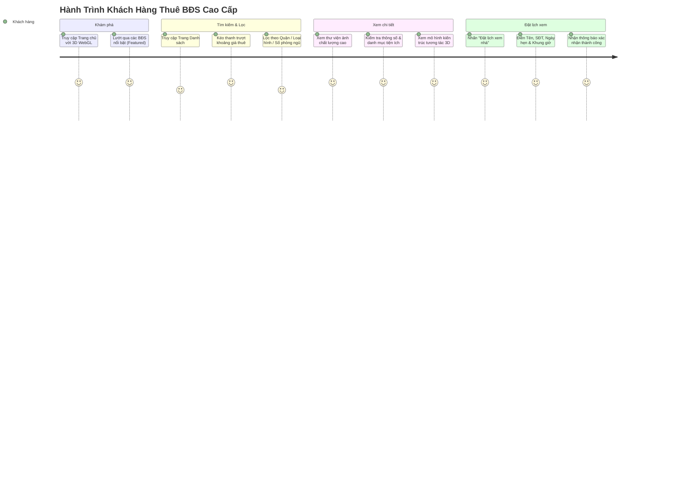

# 02 — Đặc Tả Yêu Cầu Phần Mềm (Software Requirements Specification - SRS)

Tài liệu này xác định đầy đủ các yêu cầu nghiệp vụ, chức năng và phi chức năng của dự án **LuxeEstate**. Toàn bộ tài liệu được xây dựng nhằm đảm bảo tính thống nhất giữa mục tiêu kinh doanh, trải nghiệm người dùng và việc phát triển phần mềm.

---

## 1. Mục Tiêu & Định Hướng Nghiệp Vụ (Business Goals)

### 1.1. Định Hướng 100% Cho Thuê Bất Động Sản Cao Cấp (Luxury Rental Focus)
Hệ thống được thiết kế độc quyền phục vụ thị trường **cho thuê căn hộ, penthouse, duplex và biệt thự thượng lưu**:
* **Loại bỏ hoàn toàn** các khái niệm, nút bấm hoặc luồng giao dịch liên quan đến "Mua bán", "Đặt cọc mua", "Buy Now", "For Sale".
* **Thay thế bằng chuẩn cho thuê chuyên nghiệp:**
  * Đơn vị giá: **Giá thuê theo tháng (Monthly Rent)** tính bằng USD ($) kèm quy đổi VNĐ.
  * Thông tin cho thuê bắt buộc: Tiền cọc bảo đảm (*Security Deposit*), Thời hạn hợp đồng (*Lease Term*), Thời điểm có thể dọn vào ở (*Available From*).
  * Tình trạng nội thất: *Đầy đủ nội thất (Fully Furnished)*, *Nội thất cơ bản (Semi-Furnished)*, *Nhà thô (Unfurnished)*.
* **Không yêu cầu thanh toán online:** Các giao dịch thuê BĐS cao cấp luôn đòi hỏi quá trình tham quan thực tế và ký kết hợp đồng pháp lý riêng.
* **Không yêu cầu đăng ký tài khoản khách hàng:** Tối ưu hóa phễu chuyển đổi với 2 hành động trọng tâm:
  $$\mathbf{Xem\ Bất\ Động\ Sản} \longrightarrow \mathbf{Đặt\ Lịch\ Đi\ Xem\ Nhà}$$

---

## 2. Đặc Tả Yêu Cầu Chức Năng Phân Hệ Khách Hàng (Customer Portal)



### 2.1. Quản Lý Danh Mục & Chi Tiết Bất Động Sản
* **FR-C01 — Hiển thị danh sách BĐS (`/properties`):**
  * Thẻ BĐS hiển thị đầy đủ: Ảnh đại diện, Tên BĐS, Địa điểm, Giá thuê/tháng, Loại hình, Diện tích ($m^2$), Số phòng ngủ, Số phòng tắm, Tình trạng nội thất và Nhãn trạng thái (*Còn trống / Đã cho thuê*).
* **FR-C02 — Bộ lọc thông minh đa tiêu chí:**
  * Lọc theo Địa điểm: *Tất cả, Hà Nội (Tây Hồ, Ba Đình), TP.HCM (Thảo Điền, Quận 1, Bình Thạnh), Đà Nẵng, Quảng Ninh*.
  * Lọc theo Loại hình: *Căn hộ cao cấp, Biệt thự ven sông, Penthouse, Duplex, Studio Loft*.
  * **Thanh trượt giá thuê linh hoạt:** Chọn khoảng giá từ $\$500$ đến $\$5,000+$/tháng.
  * Lọc theo Số phòng ngủ: *1+, 2+, 3+, 4+ PN*.
  * Lọc theo Tình trạng nội thất & Tình trạng phòng trống (*Available*).
* **FR-C03 — Trang chi tiết BĐS (`/properties/[slug]`):**
  * Thư viện ảnh độ phân giải cao, danh mục tiện ích chuẩn khách sạn 5 sao.
  * Bảng thông số chi tiết (Tầng, diện tích, giá cọc, ngày vào ở).
  * Khối trải nghiệm 3D tương tác kiến trúc Three.js.
  * Nút kêu gọi hành động cố định: **[Đặt lịch xem nhà]**.

### 2.2. Đặt Lịch Đi Xem Nhà (Viewing Booking Modal)
* **FR-C04 — Biểu mẫu đặt lịch:**
  * Trường nhập: Họ và tên \*, Số điện thoại \*, Email, Ngày mong muốn xem nhà \*, Khung giờ tiếp đón (Sáng 09:00 - 11:30, Chiều 14:00 - 17:30, Tối 18:00 - 20:00), Lời nhắn/Yêu cầu đặc biệt.
  * Validation: Kiểm tra định dạng số điện thoại Việt Nam/Quốc tế và địa chỉ Email hợp lệ.
  * Phản hồi trạng thái: Hiển thị thông báo hoàn tất lịch hẹn ngay lập tức và đồng bộ vào hệ thống quản trị.

### 2.3. Hỗ Trợ Đa Ngôn Ngữ (Bilingual System)
* **FR-C05 — Chuyển đổi ngôn ngữ tức thì:**
  * Hỗ trợ 100% giao diện bằng **Tiếng Việt (VI)** và **Tiếng Anh (EN)**.
  * Lưu trữ tùy chọn người dùng qua `localStorage` và `LanguageContext`.

---

## 3. Đặc Tả Yêu Cầu Chức Năng Phân Hệ Quản Trị (Admin Portal)

### 3.1. Bảo Mật & Xác Thực (Authentication & Access Control)
* **FR-A01 — Đăng nhập Quản trị (`/admin/login`):**
  * Yêu cầu nhập Email & Mật khẩu hợp lệ.
  * Cung cấp nút tiện ích 1-click **"Điền nhanh tài khoản Admin"** phục vụ demo & kiểm thử.
* **FR-A02 — Route Guard bảo vệ:**
  * Tự động chuyển hướng toàn bộ người dùng chưa xác thực truy cập vào bất kỳ trang con nào của `/admin/*` về trang đăng nhập `/admin/login`.
  * Hỗ trợ Đăng xuất an toàn và xóa bỏ Cookie phiên.

### 3.2. Dashboard Tổng Quan (`/admin/dashboard`)
* **FR-A03 — 4 Thẻ KPI Tinh Gọn:**
  * **Tổng Bất Động Sản (Total Properties):** Tổng số căn hộ hiện có trong danh mục.
  * **Đang Sẵn Sàng (Available Now):** Số căn trống sẵn sàng đón khách thuê.
  * **Lịch Hẹn Xem Nhà (Viewing Requests):** Tổng số yêu cầu xem nhà phát sinh.
  * **Chờ Duyệt (Pending Approval):** Số lịch hẹn mới cần admin xử lý ngay.
* **FR-A04 — Bảng Lịch Xem Nhà Gần Nhất (Recent Viewings):**
  * Hiển thị danh sách 5-10 lịch hẹn mới nhất kèm khách hàng, căn hộ, thời gian và trạng thái.
  * Hỗ trợ nút duyệt nhanh hoặc click xem chi tiết.

### 3.3. Trụ Cột 1: Quản Lý Bất Động Sản (`/admin/properties`)
* **FR-A05 — Danh sách BĐS & Thao tác trực tiếp:**
  * Xem dạng bảng với ảnh thumbnail, giá thuê, khu vực, trạng thái.
  * Tìm kiếm tức thì và lọc theo loại hình, trạng thái.
  * **Nút bấm 1-click:** Bật/Tắt xuất bản (*Publish / Unpublish*) và chuyển trạng thái *Available / Rented*.
  * Thao tác: Xem chi tiết preview, Sửa (`/edit`), Xóa BĐS.
* **FR-A06 — Biểu mẫu Thêm Mới / Chỉnh Sửa BĐS (`/new` & `/edit`):**
  * Phân chia thành 6 khu vực nhập liệu trực quan:
    1. *Thông tin cơ bản:* Tên BĐS \*, Loại hình \*, Khu vực \*, Địa chỉ chi tiết.
    2. *Thông tin cho thuê:* Giá thuê/tháng (USD) \*, Tiền đặt cọc, Thời điểm dọn vào.
    3. *Chi tiết căn hộ:* Số PN, Số WC, Diện tích, Tầng, Tình trạng nội thất.
    4. *Mô tả chi tiết:* Soạn thảo văn bản mô tả BĐS.
    5. *Danh mục tiện ích:* Checkbox các tiện ích (Bể bơi, Gym, Chỗ để xe, Ban công, An ninh 24/7, Smart Home,...).
    6. *Quản lý hình ảnh:* Kéo thả nhiều ảnh, xem preview, xóa ảnh, **chọn ảnh làm Cover Image**.
  * Tùy chọn lưu: **[Lưu Bản Nháp (Save Draft)]** và **[Xuất Bản (Publish Property)]**.
* **FR-A07 — Xem trước bài đăng Admin (`/admin/properties/[id]`):**
  * Xem trước giao diện giống khách hàng, kèm thanh trạng thái quản trị hiển thị giá thuê, tình trạng phòng và tổng số lượt khách đã đặt lịch xem căn này.

### 3.4. Trụ Cột 2: Quản Lý Lịch Hẹn & Lịch Tháng (`/admin/viewings`)
* **FR-A08 — Chuẩn hóa Quy trình Trạng thái Lịch hẹn (Status State Machine):**
  ```mermaid
  stateDiagram-v2
      [*] --> Pending: Khách đặt trên Website
      Pending --> Confirmed: Admin xác nhận
      Pending --> Cancelled: Khách hủy / Trùng lịch
      Confirmed --> Completed: Đã đón tiếp xem nhà xong
      Confirmed --> Cancelled: Khách báo hủy đột xuất
      Confirmed --> Confirmed: Admin dời lịch hẹn (Reschedule)
      Completed --> [*]
      Cancelled --> [*]
  ```
* **FR-A09 — Danh sách lịch hẹn:**
  * Lọc theo 5 tab: **Tất Cả**, **Chờ Duyệt (Pending)**, **Đã Xác Nhận (Confirmed)**, **Đã Xem Xong (Completed)**, **Đã Hủy (Cancelled)**.
  * Nút hành động nhanh trên từng dòng: *Xác nhận*, *Hoàn thành*, *Chi tiết*.
* **FR-A10 — Chi tiết lịch hẹn (`/admin/viewings/[id]`):**
  * Hiển thị thông tin liên hệ khách hàng (SĐT, Email), BĐS cần xem, ngày giờ hẹn và ghi chú.
  * Các nút điều phối: **[Xác Nhận Hẹn]**, **[Dời Lịch Hẹn]** (mở drawer chọn lại ngày giờ), **[Hủy Hẹn]**, **[Đánh Dấu Đã Xem Xong]**.
* **FR-A11 — Chế độ xem Lịch Tháng (Calendar View - `/admin/viewings/calendar`):**
  * Hiển thị lưới lịch tháng chuẩn thứ Hai $\rightarrow$ Chủ Nhật.
  * Hiển thị badge số lượng lịch hẹn trên mỗi ngày có khách đặt.
  * Click vào từng ngày mở danh sách phân bố các cuộc hẹn theo khung giờ (14:00, 16:00,...) ở cột bên phải kèm link mở nhanh chi tiết.

### 3.5. Trụ Cột 3: Quản Lý Khách Hàng (`/admin/customers`)
* **FR-A12 — Danh bạ khách hàng:**
  * Tự động tổng hợp thông tin khách hàng từ các yêu cầu đặt lịch xem nhà.
  * Hiển thị Tên, SĐT, Email, Tổng số lượt xem nhà, Ngày xem gần nhất.
  * Ô tìm kiếm nhanh theo tên hoặc số điện thoại.
* **FR-A13 — Hồ sơ khách hàng & Lịch sử xem nhà (`/admin/customers/[id]`):**
  * Thẻ hồ sơ thông tin liên hệ và ghi chú nhu cầu của khách.
  * **Dòng thời gian Lịch sử xem nhà (Viewing History Timeline):** Liệt kê toàn bộ các căn hộ khách đã từng xem hoặc đang chờ xem, giúp môi giới nắm rõ lịch sử và nhu cầu thuê của từng khách.

### 3.6. Thông Báo & Cài Đặt Hệ Thống
* **FR-A14 — Chuông thông báo (`🔔 3`):**
  * Đặt trên thanh Header Admin, hiển thị badge số lượng lịch hẹn mới chưa đọc.
  * Dropdown cho phép xem nhanh thông báo mới và click để mở trực tiếp chi tiết lịch hẹn.
* **FR-A15 — Cài đặt hệ thống (`/admin/settings`):**
  * Quản lý thông tin hồ sơ Admin (Tên, Email, Hotline trực ban).
  * Tùy chọn Bật/Tắt nhận thông báo qua chuông và email khi có yêu cầu mới, khi duyệt lịch hoặc khi hủy lịch.

---

## 4. Yêu Cầu Phi Chức Năng (Non-Functional Requirements)

1. **Hiệu năng & Tốc độ (Performance):**
   * Phân hệ Admin: Tải trang và tương tác nội bộ $< 50\text{ms}$, loại bỏ hoàn toàn các render 3D để không gây tải CPU.
   * Phân hệ Khách hàng: Điểm số Google Lighthouse Performance $\ge 90$, FCP $< 1.2\text{s}$, duy trì 60 FPS mượt mà cho hiệu ứng cuộn.
2. **Khả năng tương thích thiết bị (Responsiveness):**
   * Tương thích 100% trên màn hình Desktop ($1920\text{px}$, $1440\text{px}$), Laptop, Tablet và Mobile.
   * Menu Admin tự động thu gọn thành **Drawer/Hamburger Navigation** trên thiết bị di động.
3. **Bảo mật (Security):**
   * Toàn bộ dữ liệu truyền tải bắt buộc qua HTTPS / TLS 1.3.
   * Xử lý Cookie phiên đăng nhập với thuộc tính `HttpOnly` và `SameSite=Lax`.
   * Lọc và kiểm tra tính hợp lệ của toàn bộ dữ liệu đầu vào (Input Sanitization) nhằm ngăn chặn tấn công XSS và SQL Injection.
