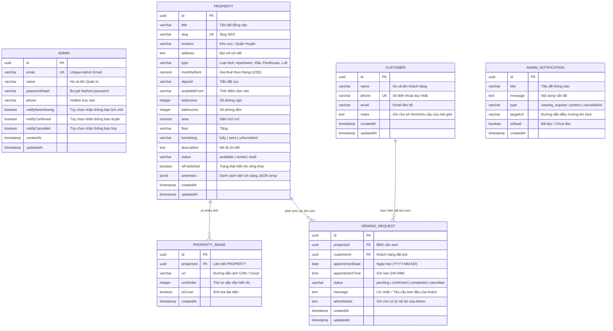

# 04 — Thiết Kế Cơ Sở Dữ Liệu (Database Schema & Data Architecture)

Tài liệu này định nghĩa mô hình dữ liệu quan hệ (Entity-Relationship Model), cấu trúc bảng, khóa chính/ngoại, chỉ mục (Indexes) và kịch bản di chuyển (DDL Scripts / Prisma Schema) của hệ thống **LuxeEstate**.

---

## 1. Sơ Đồ Thực Thể Quan Hệ (Mermaid ERD)



---

## 2. Chi Tiết Các Bảng & Ràng Buộc Dữ Liệu

### 2.1. Bảng `properties` (Quản Lý Bất Động Sản Cho Thuê)
| Cột | Kiểu Dữ Liệu | Ràng Buộc | Ý Nghĩa Nghiệp Vụ |
| :--- | :--- | :--- | :--- |
| `id` | `UUID` | `PRIMARY KEY` | Khóa chính duy nhất |
| `title` | `VARCHAR(255)` | `NOT NULL` | Tên căn hộ / Biệt thự |
| `slug` | `VARCHAR(255)` | `UNIQUE, NOT NULL` | Đường dẫn thân thiện SEO (`/properties/[slug]`) |
| `location` | `VARCHAR(255)` | `NOT NULL` | Quận/Huyện, Tỉnh/TP |
| `address` | `TEXT` | `NULL` | Địa chỉ chính xác |
| `type` | `VARCHAR(50)` | `NOT NULL` | Apartment, Villa, Penthouse, Duplex, Loft |
| `monthly_rent` | `NUMERIC(10,2)` | `NOT NULL` | Giá thuê tính theo tháng (USD) |
| `deposit` | `VARCHAR(100)` | `NULL` | Điều kiện cọc (Ví dụ: "2 tháng tiền thuê") |
| `available_from`| `VARCHAR(100)` | `NULL` | Ngày có thể dọn vào ở |
| `bedrooms` | `INT` | `NOT NULL, DEFAULT 1`| Số phòng ngủ |
| `bathrooms` | `INT` | `NOT NULL, DEFAULT 1`| Số phòng vệ sinh |
| `area` | `NUMERIC(8,2)` | `NOT NULL` | Diện tích thông thủy ($m^2$) |
| `floor` | `VARCHAR(50)` | `NULL` | Vị trí tầng |
| `furnishing` | `VARCHAR(50)` | `NOT NULL` | `fully` (Đầy đủ), `semi` (Cơ bản), `unfurnished` (Nhà thô) |
| `description` | `TEXT` | `NULL` | Bài viết giới thiệu căn nhà |
| `status` | `VARCHAR(50)` | `NOT NULL, DEFAULT 'available'` | `available` (Còn trống), `rented` (Đã cho thuê), `draft` (Bản nháp) |
| `is_published` | `BOOLEAN` | `NOT NULL, DEFAULT TRUE` | Bật/tắt hiển thị ngoài website khách hàng |
| `amenities` | `JSONB` | `DEFAULT '[]'` | Mảng danh sách tiện ích đi kèm |

### 2.2. Bảng `viewing_requests` (Lịch Hẹn Xem Nhà)
| Cột | Kiểu Dữ Liệu | Ràng Buộc | Ý Nghĩa Nghiệp Vụ |
| :--- | :--- | :--- | :--- |
| `id` | `UUID` | `PRIMARY KEY` | Mã lịch hẹn |
| `property_id` | `UUID` | `FOREIGN KEY` | Tham chiếu tới `properties(id)` |
| `customer_id` | `UUID` | `FOREIGN KEY` | Tham chiếu tới `customers(id)` |
| `appointment_date` | `DATE` | `NOT NULL` | Ngày hẹn đi xem thực tế |
| `appointment_time` | `TIME` | `NOT NULL` | Giờ đón tiếp khách |
| `status` | `VARCHAR(50)` | `NOT NULL, DEFAULT 'pending'` | `pending`, `confirmed`, `completed`, `cancelled` |
| `message` | `TEXT` | `NULL` | Tin nhắn ban đầu của khách |
| `admin_notes` | `TEXT` | `NULL` | Ghi chú điều phối chuyên viên của quản trị viên |

### 2.3. Bảng `customers` (Danh Bạ Khách Hàng)
| Cột | Kiểu Dữ Liệu | Ràng Buộc | Ý Nghĩa Nghiệp Vụ |
| :--- | :--- | :--- | :--- |
| `id` | `UUID` | `PRIMARY KEY` | Mã định danh khách hàng |
| `name` | `VARCHAR(255)` | `NOT NULL` | Họ tên khách hàng |
| `phone` | `VARCHAR(20)` | `UNIQUE, NOT NULL` | Số điện thoại dùng làm khóa nhận diện khách |
| `email` | `VARCHAR(255)` | `NULL` | Email giao dịch |
| `notes` | `TEXT` | `NULL` | Nhận xét sở thích/nhu cầu của khách hàng |

---

## 3. Kịch Bản DDL Tạo Bảng Chuẩn PostgreSQL (Direct SQL Script)

```sql
-- Kích hoạt extension sinh UUID ngẫu nhiên
CREATE EXTENSION IF NOT EXISTS "uuid-ossp";

-- 1. Bảng Quản trị viên
CREATE TABLE admins (
    id UUID PRIMARY KEY DEFAULT uuid_generate_v4(),
    email VARCHAR(255) NOT NULL UNIQUE,
    name VARCHAR(255) NOT NULL,
    password_hash VARCHAR(255) NOT NULL,
    phone VARCHAR(50),
    notify_new_viewing BOOLEAN NOT NULL DEFAULT TRUE,
    notify_confirmed BOOLEAN NOT NULL DEFAULT TRUE,
    notify_cancelled BOOLEAN NOT NULL DEFAULT TRUE,
    created_at TIMESTAMP WITH TIME ZONE DEFAULT CURRENT_TIMESTAMP,
    updated_at TIMESTAMP WITH TIME ZONE DEFAULT CURRENT_TIMESTAMP
);

-- 2. Bảng Bất động sản
CREATE TABLE properties (
    id UUID PRIMARY KEY DEFAULT uuid_generate_v4(),
    title VARCHAR(255) NOT NULL,
    slug VARCHAR(255) NOT NULL UNIQUE,
    location VARCHAR(255) NOT NULL,
    address TEXT,
    type VARCHAR(50) NOT NULL,
    monthly_rent NUMERIC(10,2) NOT NULL,
    deposit VARCHAR(100),
    available_from VARCHAR(100),
    bedrooms INT NOT NULL DEFAULT 1,
    bathrooms INT NOT NULL DEFAULT 1,
    area NUMERIC(8,2) NOT NULL,
    floor VARCHAR(50),
    furnishing VARCHAR(50) NOT NULL DEFAULT 'fully',
    description TEXT,
    status VARCHAR(50) NOT NULL DEFAULT 'available',
    is_published BOOLEAN NOT NULL DEFAULT TRUE,
    amenities JSONB DEFAULT '[]'::jsonb,
    created_at TIMESTAMP WITH TIME ZONE DEFAULT CURRENT_TIMESTAMP,
    updated_at TIMESTAMP WITH TIME ZONE DEFAULT CURRENT_TIMESTAMP
);

CREATE INDEX idx_properties_status ON properties(status);
CREATE INDEX idx_properties_type ON properties(type);
CREATE INDEX idx_properties_monthly_rent ON properties(monthly_rent);

-- 3. Bảng Hình ảnh BĐS
CREATE TABLE property_images (
    id UUID PRIMARY KEY DEFAULT uuid_generate_v4(),
    property_id UUID NOT NULL REFERENCES properties(id) ON DELETE CASCADE,
    url TEXT NOT NULL,
    sort_order INT NOT NULL DEFAULT 0,
    is_cover BOOLEAN NOT NULL DEFAULT FALSE,
    created_at TIMESTAMP WITH TIME ZONE DEFAULT CURRENT_TIMESTAMP
);

CREATE INDEX idx_property_images_property ON property_images(property_id);

-- 4. Bảng Khách hàng
CREATE TABLE customers (
    id UUID PRIMARY KEY DEFAULT uuid_generate_v4(),
    name VARCHAR(255) NOT NULL,
    phone VARCHAR(20) NOT NULL UNIQUE,
    email VARCHAR(255),
    notes TEXT,
    created_at TIMESTAMP WITH TIME ZONE DEFAULT CURRENT_TIMESTAMP,
    updated_at TIMESTAMP WITH TIME ZONE DEFAULT CURRENT_TIMESTAMP
);

CREATE INDEX idx_customers_phone ON customers(phone);

-- 5. Bảng Lịch hẹn xem nhà
CREATE TABLE viewing_requests (
    id UUID PRIMARY KEY DEFAULT uuid_generate_v4(),
    property_id UUID NOT NULL REFERENCES properties(id) ON DELETE CASCADE,
    customer_id UUID NOT NULL REFERENCES customers(id) ON DELETE CASCADE,
    appointment_date DATE NOT NULL,
    appointment_time TIME NOT NULL,
    status VARCHAR(50) NOT NULL DEFAULT 'pending',
    message TEXT,
    admin_notes TEXT,
    created_at TIMESTAMP WITH TIME ZONE DEFAULT CURRENT_TIMESTAMP,
    updated_at TIMESTAMP WITH TIME ZONE DEFAULT CURRENT_TIMESTAMP
);

CREATE INDEX idx_viewings_appointment_date ON viewing_requests(appointment_date);
CREATE INDEX idx_viewings_status ON viewing_requests(status);

-- 6. Bảng Thông báo Admin
CREATE TABLE admin_notifications (
    id UUID PRIMARY KEY DEFAULT uuid_generate_v4(),
    title VARCHAR(255) NOT NULL,
    message TEXT NOT NULL,
    type VARCHAR(50) NOT NULL DEFAULT 'viewing_request',
    target_url VARCHAR(255),
    is_read BOOLEAN NOT NULL DEFAULT FALSE,
    created_at TIMESTAMP WITH TIME ZONE DEFAULT CURRENT_TIMESTAMP
);

CREATE INDEX idx_notifications_unread ON admin_notifications(is_read) WHERE is_read = FALSE;
```

---

## 4. Prisma Schema (Kế Hoạch Nâng Cấp Tương Lai)

Khi dự án nâng cấp từ In-Memory Store lên PostgreSQL có quản lý kết nối (*Connection Pooling* với Supabase hoặc Neon), cấu hình Prisma schema tương thích hoàn toàn như sau:

```prisma
datasource db {
  provider = "postgresql"
  url      = env("DATABASE_URL")
}

generator client {
  provider = "prisma-client-js"
}

model Admin {
  id                String   @id @default(uuid())
  email             String   @unique
  name              String
  passwordHash      String
  phone             String?
  notifyNewViewing  Boolean  @default(true)
  notifyConfirmed   Boolean  @default(true)
  notifyCancelled   Boolean  @default(true)
  createdAt         DateTime @default(now())
  updatedAt         DateTime @updatedAt
}

model Property {
  id             String           @id @default(uuid())
  title          String
  slug           String           @unique
  location       String
  address        String?
  type           String
  monthlyRent    Float
  deposit        String?
  availableFrom  String?
  bedrooms       Int              @default(1)
  bathrooms      Int              @default(1)
  area           Float
  floor          String?
  furnishing     String           @default("fully")
  description    String?
  status         String           @default("available")
  isPublished    Boolean          @default(true)
  amenities      String[]
  images         PropertyImage[]
  viewings       ViewingRequest[]
  createdAt      DateTime         @default(now())
  updatedAt      DateTime         @updatedAt
}

model PropertyImage {
  id         String   @id @default(uuid())
  propertyId String
  property   Property @relation(fields: [propertyId], references: [id], onDelete: Cascade)
  url        String
  sortOrder  Int      @default(0)
  isCover    Boolean  @default(false)
  createdAt  DateTime @default(now())
}

model Customer {
  id        String           @id @default(uuid())
  name      String
  phone     String           @unique
  email     String?
  notes     String?
  viewings  ViewingRequest[]
  createdAt DateTime         @default(now())
  updatedAt DateTime         @updatedAt
}

model ViewingRequest {
  id              String   @id @default(uuid())
  propertyId      String
  property        Property @relation(fields: [propertyId], references: [id], onDelete: Cascade)
  customerId      String
  customer        Customer @relation(fields: [customerId], references: [id], onDelete: Cascade)
  appointmentDate DateTime @db.Date
  appointmentTime String
  status          String   @default("pending")
  message         String?
  adminNotes      String?
  createdAt       DateTime @default(now())
  updatedAt       DateTime @updatedAt
}

model AdminNotification {
  id        String   @id @default(uuid())
  title     String
  message   String
  type      String   @default("viewing_request")
  targetUrl String?
  isRead    Boolean  @default(false)
  createdAt DateTime @default(now())
}
```
