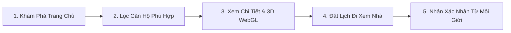

# 05 — Sổ Tay Vận Hành & Hướng Dẫn Sử Dụng (User & Admin Guide)

Tài liệu này cung cấp hướng dẫn từng bước (Step-by-step) dành cho khách hàng trải nghiệm dịch vụ và đội ngũ quản trị viên, môi giới vận hành hệ thống **LuxeEstate**.

---

## PHẦN A: HƯỚNG DẪN TRẢI NGHIỆM DÀNH CHO KHÁCH HÀNG (CUSTOMER PORTAL)

### 1. Khám Phá & Lọc Bất Động Sản Cho Thuê
1. **Truy cập Trang Danh Mục (`/properties`):**
   * Người dùng nhìn thấy danh sách các căn hộ, penthouse và biệt thự đang niêm yết cho thuê.
   * Trên mỗi thẻ hiển thị rõ: Ảnh đại diện, Tên BĐS, Địa điểm, **Giá thuê theo tháng (USD & VNĐ)**, Số phòng ngủ, Số phòng tắm, Diện tích và Tình trạng nội thất.
2. **Sử dụng Bộ Lọc Đa Tiêu Chí:**
   * **Khoảng Giá Thuê (Monthly Rent):** Kéo thanh trượt để giới hạn mức ngân sách mong muốn (từ $\$500$ tới $\$5,000+$/tháng).
   * **Khu vực (Location):** Chọn nhanh các thành phố lớn hoặc quận trọng điểm (Hà Nội, TP.HCM, Đà Nẵng, Quảng Ninh).
   * **Loại hình (Property Type):** Lọc theo Căn hộ cao cấp, Penthouse, Duplex, Biệt thự hoặc Studio Loft.
   * **Nội thất (Furnishing):** Chọn Đầy đủ nội thất (*Fully Furnished*), Nội thất cơ bản hoặc Nhà thô.

### 2. Xem Chi Tiết Bất Động Sản (`/properties/[slug]`)
1. **Thư viện hình ảnh:** Lướt qua các góc chụp thực tế với độ phân giải cao của phòng khách, phòng ngủ, ban công và tầm nhìn thực tế.
2. **Khám phá 3D tương tác kiến trúc:** Tương tác với khối không gian 3D Three.js mô phỏng hình khối và chất liệu của dự án.
3. **Thông số cho thuê:** Nắm rõ thời hạn hợp đồng, thời điểm sẵn sàng dọn vào và tiền đặt cọc bảo đảm.

### 3. Đặt Lịch Đi Xem Nhà (Book a Viewing)
1. Nhấn nút **[Đặt lịch xem nhà / Schedule a Viewing]** xuất hiện cố định trên màn hình chi tiết.
2. Cửa sổ Modal hiện đại sẽ mở ra:
   * Nhập **Họ và tên**.
   * Nhập **Số điện thoại** chính xác để chuyên viên tiện liên hệ đón tiếp.
   * Nhập **Email** (tùy chọn).
   * Chọn **Ngày mong muốn đến xem** và **Khung giờ thuận tiện** (Sáng, Chiều hoặc Tối).
   * Điền lời nhắn hoặc yêu cầu riêng (nếu có xe ô tô, nuôi thú cưng,...).
3. Bấm **[Xác Nhận Đặt Lịch]**. Hệ thống sẽ phản hồi thông báo thành công và chuyển thông tin ngay lập tức vào Admin Portal.

---

## PHẦN B: SỔ TAY VẬN HÀNH QUẢN TRỊ VIÊN (ADMIN OPERATIONS MANUAL)

> **Địa chỉ Portal Quản trị:** [https://luxury-estate-self.vercel.app/admin](https://luxury-estate-self.vercel.app/admin)  
> **Tài khoản quản trị mặc định:** `admin@luxeestate.vn` / Mật khẩu: `admin123`

---

### 1. Đăng Nhập & Quản Lý Phiên Làm Việc (`/admin/login`)
1. Truy cập `/admin/login`.
2. Có thể nhập trực tiếp Email & Mật khẩu hoặc nhấn nút **"Điền nhanh tài khoản Admin"** để hệ thống tự điền thông tin demo.
3. Nhấn **[Đăng Nhập Quản Trị]** để vào màn hình chính.
4. Muốn kết thúc phiên làm việc, nhấn vào biểu tượng Đăng xuất ở góc dưới bên trái của thanh Sidebar.

---

### 2. Màn Hình Tổng Quan (Dashboard Home - `/admin/dashboard`)
Đây là trung tâm điều hành hiển thị 4 chỉ số KPI quan trọng nhất:
1. **Total Properties (Tổng BĐS):** Theo dõi quy mô danh mục hiện có.
2. **Available (Đang trống):** Nắm bắt số lượng căn sẵn sàng ký hợp đồng cho thuê ngay.
3. **Viewing Requests (Tổng lượt xem):** Tổng nhu cầu thị trường đối với rổ hàng.
4. **Pending (Chờ duyệt):** Các yêu cầu mới đặt trong 24 giờ qua cần chuyên viên liên hệ xác nhận gấp.
* **Bảng Recent Viewing Requests:** Hiển thị 5 cuộc hẹn mới nhất. Admin có thể click **[Xác Nhận]** trực tiếp ngay trên bảng hoặc click tên căn hộ để xem chi tiết.

---

### 3. Quản Lý Bất Động Sản (`/admin/properties`)

#### A. Danh Sách & Hành Động 1-Click
* **Tìm kiếm:** Nhập tên căn hộ hoặc địa điểm vào ô tìm kiếm để lọc kết quả tức thì.
* **Bật/Tắt Niêm Yết (Publish / Unpublish):** Click công tắc chuyển trạng thái để ẩn căn hộ khỏi website khách hàng mà không cần xóa dữ liệu.
* **Chuyển Trạng Thái Thuê (Available / Rented):** Khi khách hàng đã ký hợp đồng thuê, click chuyển trạng thái thành `Rented` để website hiển thị nhãn "Đã Cho Thuê".

#### B. Thêm Mới Bất Động Sản (`/admin/properties/new`)
Form được chia thành 6 khu vực nhập liệu chuyên nghiệp:
1. **Thông tin cơ bản:** Nhập Tên BĐS, Loại hình, Khu vực (Quận/Huyện) và Địa chỉ cụ thể.
2. **Thông tin cho thuê:** Nhập Giá thuê theo tháng (USD), Tiền cọc (Ví dụ: 2 tháng), Thời điểm dọn vào ở.
3. **Chi tiết căn hộ:** Nhập số Phòng ngủ, Phòng tắm, Diện tích ($m^2$), Tầng, Tình trạng nội thất.
4. **Mô tả:** Viết đoạn văn giới thiệu điểm nổi bật và phong cách thiết kế của căn nhà.
5. **Tiện ích (Amenities Checkboxes):** Tích chọn các tiện ích có sẵn như: Hồ bơi vô cực, Chỗ đỗ xe ô tô, Phòng Gym, Ban công ngắm cảnh, Thang máy riêng, Smart Home,...
6. **Hình ảnh:** Kéo thả ảnh hoặc chọn file từ máy tính. Xem trước ảnh thumbnail và click **"Chọn làm Cover"** cho bức ảnh đại diện đẹp nhất.
* Bấm **[Save Draft]** nếu muốn lưu bản nháp chưa công khai, hoặc **[Publish Property]** để niêm yết lên website ngay lập tức.

#### C. Chi Tiết Xem Trước & Chỉnh Sửa (`/[id]` & `/[id]/edit`)
* Nhấn vào bất kỳ căn hộ nào để xem trước giao diện giống như khách hàng nhìn thấy, đồng thời theo dõi các chỉ số quan trọng (Giá thuê, Trạng thái, Tổng số lượt khách đã đặt xem căn hộ này).
* Nhấn nút **[Edit Property]** để cập nhật lại bất kỳ thông tin nào khi có thay đổi về giá hoặc tình trạng bàn giao.

---

### 4. Quản Lý Lịch Xem Nhà (`/admin/viewings`) & Lịch Tháng (`/calendar`)

#### A. Quy Trình Chuẩn Hóa Điều Phối Lịch Xem Nhà
Hệ thống vận hành theo chu trình khép kín:
$$\mathbf{Chờ\ Duyệt\ (Pending)} \xrightarrow{\text{Admin bấm Xác Nhận}} \mathbf{Đã\ Xác\ Nhận\ (Confirmed)} \xrightarrow{\text{Đã\ đưa\ khách\ xem}} \mathbf{Hoàn\ Thành\ (Completed)}$$
*(Trường hợp khách bận hoặc hủy hẹn: Chuyển trạng thái sang **Đã Hủy (Cancelled)**)*

#### B. Thao Tác Chi Tiết Lịch Hẹn (`/admin/viewings/[id]`)
Khi mở một yêu cầu xem nhà, màn hình hiển thị đầy đủ:
* Thông tin khách hàng (Tên, SĐT gọi trực tiếp, Email).
* Thông tin BĐS (Tên, địa chỉ đón khách, giá thuê).
* Thời gian hẹn (Ngày và giờ).
* **4 Nút Nghiệp Vụ:**
  * **[Xác Nhận Hẹn]:** Phê duyệt lịch hẹn và gửi thông báo xác nhận.
  * **[Dời Lịch Hẹn (Reschedule)]:** Mở giao diện chọn lại ngày và giờ mới khi khách xin đổi lịch.
  * **[Hủy Hẹn]:** Ghi nhận hủy cuộc hẹn.
  * **[Đánh Dấu Hoàn Thành]:** Đánh dấu sau khi chuyên viên đã dẫn khách tham quan thực tế xong.

#### C. Chế Độ Xem Lịch Tháng Trực Quan (Calendar Schedule - `/admin/viewings/calendar`)
* Nhấp vào **"Lịch Tháng (Calendar View)"** trên thanh điều hướng.
* Toàn bộ các ngày trong tháng có lịch hẹn sẽ được gắn badge số lượng cuộc hẹn nổi bật (ví dụ: `2 lịch hẹn`, `1 lịch hẹn`).
* **Click vào ngày bất kỳ:** Cột bên phải lập tức hiển thị danh sách các cuộc hẹn trong ngày được sắp xếp theo từng mốc giờ (14:00, 16:00,...), tên khách và căn hộ tương ứng, kèm nút mở nhanh chi tiết.

---

### 5. Quản Lý Khách Hàng & Dòng Thời Gian Lịch Sử (`/admin/customers`)
1. **Danh bạ khách hàng:**
   * Tự động lưu lại thông tin khách hàng từ form đặt lịch mà không cần nhập liệu thủ công.
   * Thể hiện rõ: Tên khách, Số điện thoại, Email, Số căn hộ đã từng đặt xem, Ngày xem gần nhất.
2. **Hồ Sơ Chi Tiết & Viewing History (`/admin/customers/[id]`):**
   * Hiển thị toàn bộ các căn hộ mà khách hàng này đã từng xem hoặc đang chờ xem cùng trạng thái thực tế.
   * Giúp nhân viên môi giới nắm rõ gu thẩm mỹ, mức ngân sách và loại hình BĐS mà khách đang quan tâm để tư vấn chốt hợp đồng thuê hiệu quả nhất.

---

### 6. Chuông Thông Báo & Cài Đặt Hệ Thống
1. **Chuông Thông Báo (`🔔 3`):**
   * Đặt tại góc trên bên phải màn hình.
   * Khi khách gửi yêu cầu đặt lịch mới ngoài website, chuông sẽ lập tức hiển thị số lượng chưa đọc.
   * Click vào chuông để xem danh sách các thông báo mới nhất và click chuyển thẳng đến lịch hẹn cần xử lý.
2. **Cài Đặt (`/admin/settings`):**
   * Quản lý thông tin họ tên, email nhận báo cáo và số điện thoại hotline trực ban.
   * Bật/tắt các tùy chọn nhận thông báo khi có lịch hẹn mới hoặc khi lịch bị hủy.
