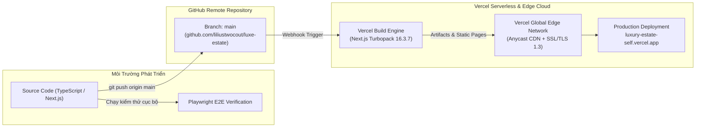

# 06 — Triển Khai & Vận Hành Hệ Thống (Deployment, DevOps & CI/CD)

Tài liệu này hướng dẫn chi tiết quy trình đóng gói, triển khai hạ tầng đám mây (Cloud Infrastructure), thiết lập CI/CD với GitHub, cấu hình Vercel Production và quy trình kiểm thử tự động với Playwright của hệ thống **LuxeEstate**.

---

## 1. Kiến Trúc Hạ Tầng Triển Khai (Infrastructure Architecture)



---

## 2. Thông Tin Triển Khai Thực Tế (Live Production Specs)

* **Production URL:** [https://luxury-estate-self.vercel.app](https://luxury-estate-self.vercel.app)
* **Hosting Provider:** Vercel Global Edge Network (Edge Nodes: IAD1, SIN1, NRT1)
* **Node.js Runtime:** Node.js v22 LTS (Active)
* **Next.js Engine:** v16.3.7 with Turbopack & React 19
* **SSL/TLS:** Let's Encrypt Wildcard Certificate (HTTP/2 & HTTP/3 QUIC)

---

## 3. Cấu Hình Vercel (`vercel.json`)

Tệp `vercel.json` được tối ưu hóa để đảm bảo bảo mật cao cấp (Security Headers) và cấu hình nén tài nguyên tĩnh:

```json
{
  "framework": "nextjs",
  "cleanUrls": true,
  "headers": [
    {
      "source": "/(.*)",
      "headers": [
        {
          "key": "X-Content-Type-Options",
          "value": "nosniff"
        },
        {
          "key": "X-Frame-Options",
          "value": "DENY"
        },
        {
          "key": "X-XSS-Protection",
          "value": "1; mode=block"
        },
        {
          "key": "Referrer-Policy",
          "value": "strict-origin-when-cross-origin"
        }
      ]
    },
    {
      "source": "/test-screenshots/(.*)",
      "headers": [
        {
          "key": "Cache-Control",
          "value": "public, max-age=31536000, immutable"
        }
      ]
    }
  ]
}
```

---

## 4. Quy Trình Xuất Bản Bản Mới (Deployment Pipeline)

### Bước 1: Kiểm Tra Cú Pháp & Build Kiểm Thử Cục Bộ
Trước khi commit, luôn chạy lệnh kiểm tra tính hợp lệ của TypeScript và quy trình đóng gói:

```bash
# Kiểm tra định dạng và lỗi cú pháp
npm run lint

# Chạy build kiểm thử với Turbopack
npm run build
```
Khi build kết thúc với mã `0`, toàn bộ 27 static/dynamic routes đã được tối ưu hóa thành công.

### Bước 2: Đồng Bộ Lên GitHub
Đẩy toàn bộ mã nguồn lên nhánh chính của kho lưu trữ GitHub:

```powershell
git add .
git commit -m "feat: your feature summary"
git push origin main
```

### Bước 3: Xuất Bản Trực Tiếp Lên Vercel Production
Dự án được kết nối trực tiếp với Vercel CLI. Để xuất bản bản cập nhật mới nhất ra môi trường Production:

```bash
npx -y vercel --prod --yes
```

Lệnh trên sẽ tự động:
1. Tải lên mã nguồn mới lên hệ thống Vercel.
2. Kích hoạt môi trường build máy ảo độc lập (2 Cores, 8GB RAM).
3. Biên dịch Next.js production bundle.
4. Tự động alias bản build mới nhất tới tên miền chính: `https://luxury-estate-self.vercel.app`.

---

## 5. Quy Trình Kiểm Thử Tự Động (Playwright E2E Verification Engine)

Hệ thống tích hợp sẵn kịch bản kiểm thử tự động toàn diện tại `scripts/verify-admin.mjs` sử dụng **Playwright Headless Browser**. Kịch bản tự động mô phỏng chuỗi hành động của người dùng thực tế và ghi lại ảnh chụp màn hình xác thực chất lượng giao diện (Visual QA).

### Các Bước Kịch Bản Kiểm Thử Tự Động:
1. **Kiểm tra đăng nhập:** Truy cập `/admin/login`, click nút "Điền nhanh", submit form và xác thực chuyển hướng thành công về `/admin/dashboard`.
2. **Kiểm tra Dashboard:** Xác minh 4 thẻ thống kê KPI hiển thị đầy đủ số liệu và bảng lịch xem gần nhất.
3. **Kiểm tra Bất động sản:** Truy cập `/admin/properties`, kiểm tra danh sách BĐS, lọc tìm kiếm.
4. **Kiểm tra Form Thêm mới:** Truy cập `/admin/properties/new`, kiểm tra đủ 6 phân mục và các checkbox tiện ích.
5. **Kiểm tra Quản lý Lịch hẹn:** Truy cập `/admin/viewings`, kiểm tra 5 tab trạng thái.
6. **Kiểm tra Lịch Tháng (Calendar View):** Truy cập `/admin/viewings/calendar`, kiểm tra lưới tháng và panel danh sách theo giờ.
7. **Kiểm tra Khách hàng:** Truy cập `/admin/customers`, kiểm tra danh bạ và mở hồ sơ lịch sử xem nhà.
8. **Kiểm tra Cài đặt:** Truy cập `/admin/settings`, kiểm tra các toggle thông báo.

### Lệnh Chạy Kiểm Thử:
```bash
node scripts/verify-admin.mjs
```
*Toàn bộ ảnh chụp màn hình kết quả được lưu tại thư mục `public/test-screenshots/` phục vụ việc đối soát và báo cáo.*

---

## 6. Danh Mục Tối Ưu Hiệu Năng & Giám Sát (Performance & Monitoring)

1. **Next.js Turbopack Bundle Analyzer:**
   * Tách code tự động (Automatic Code Splitting) theo từng route.
   * Các thư viện nặng như `three.js` chỉ được nạp động trên các trang có 3D Canvas, không làm chậm các trang quản trị Admin.
2. **Tối Ưu Hình Ảnh:**
   * Tận dụng `next/image` với các định dạng thế hệ mới (`WebP`, `AVIF`).
   * Sử dụng CDN Unsplash chất lượng cao có tham số `auto=format&fit=crop&q=80`.
3. **Giám Sát Sự Cố (Error Monitoring & Rollback):**
   * Trong trường hợp xảy ra sự cố trên bản phát hành mới, có thể rollback tức thì (< 2 giây) về bản build trước đó trên Vercel Dashboard bằng tính năng **Instant Rollback**.
