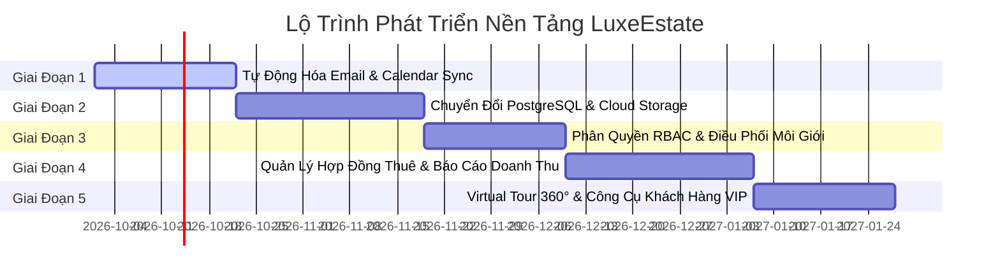
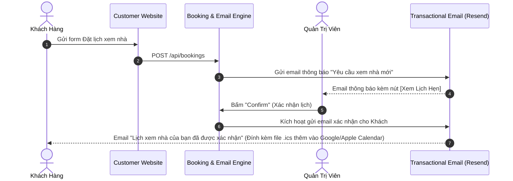
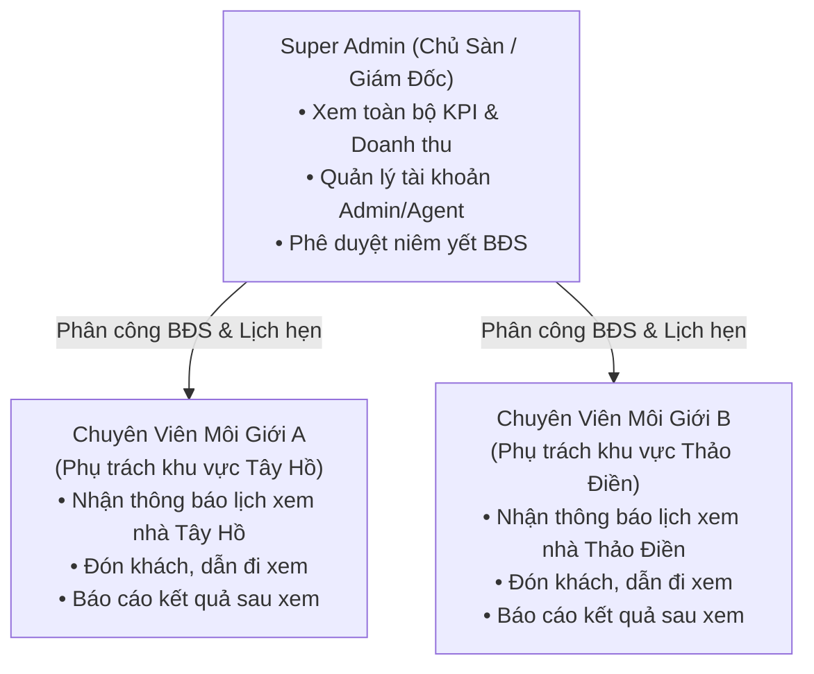

# 08 — Lộ Trình Phát Triển Tiếp Theo (Future Development Roadmap)

Tài liệu này xác định chiến lược và lộ trình phát triển tiếp theo cho nền tảng **LuxeEstate** sau khi đã hoàn thành phiên bản MVP (Website cho thuê BĐS cao cấp 3D + Admin Portal tinh gọn 3 trụ cột).

---

## 1. Tổng Quan Lộ Trình (Strategic Roadmap Overview)

Sau khi luồng cốt lõi **"Khách xem nhà $\rightarrow$ Lọc $\rightarrow$ Đặt lịch xem $\rightarrow$ Admin tiếp nhận & điều phối"** đã vận hành mượt mà, hệ thống sẽ tiến hóa theo 5 giai đoạn có thứ tự ưu tiên rõ ràng:

---

## 2. Chi Tiết Các Giai Đoạn Phát Triển (Phase-by-Phase Breakdown)

### 🚀 Giai Đoạn 1: Tự Động Hóa Email & Tích Hợp Lịch (Email & Calendar Automation)
> **Mức độ ưu tiên:** 🔴 **Khẩn cấp (P0)**  
> **Thời gian dự kiến:** 2 — 3 tuần  
> **Mục tiêu:** Khép kín vòng phản hồi liên lạc giữa Khách hàng và Quản trị viên, loại bỏ hoàn toàn việc phải gọi điện thủ công để xác nhận lịch ban đầu.

#### Các Hạng Mục Kỹ Thuật:
1. **Tích hợp Transactional Email Provider:**
   * Sử dụng [Resend](https://resend.com) hoặc [SendGrid] kết hợp React Email templates (`@react-email/components`) để tạo email HTML sang trọng, đồng bộ nhận diện thương hiệu LuxeEstate.
2. **Template Email Tự Động:**
   * `NewBookingAdminNotification`: Gửi ngay cho Admin khi có khách đặt lịch.
   * `BookingConfirmationCustomer`: Gửi cho khách khi Admin duyệt lịch, đính kèm địa chỉ đón tiếp, thông tin môi giới trực ban và file hẹn `.ics`.
   * `BookingRescheduled`: Gửi cho khách kèm khung giờ mới và lý do dời lịch.
   * `BookingCancelled`: Thông báo hủy lịch lịch sự kèm gợi ý các khung giờ hoặc căn hộ khác.
3. **Tệp cần tác động:**
   * Tạo: `src/lib/email.ts`, `src/components/emails/BookingConfirmation.tsx`
   * Sửa: `src/app/api/bookings/route.ts`, `src/app/api/admin/viewings/[id]/route.ts`

---

### 🗄️ Giai Đoạn 2: Cơ Sở Dữ Liệu PostgreSQL & Lưu Trữ Đám Mây (Persistence & Cloud Storage)
> **Mức độ ưu tiên:** 🔴 **Quan trọng (P1)**  
> **Thời gian dự kiến:** 3 — 4 tuần  
> **Mục tiêu:** Chuyển đổi từ In-Memory Store sang Cơ sở dữ liệu quan hệ bền vững, lưu trữ hình ảnh thực tế từ thiết bị lên Cloud CDN.

#### Các Hạng Mục Kỹ Thuật:
1. **Triển khai Database PostgreSQL:**
   * Sử dụng **Neon Serverless Postgres** hoặc **Supabase** kết nối với Vercel qua Connection Pooling.
   * Sử dụng **Prisma ORM** triển khai toàn bộ schema đã đặc tả tại `docs/04_DATABASE_SCHEMA.md`.
   * Chạy Seed script di chuyển toàn bộ dữ liệu mẫu hiện có vào DB chính thức.
2. **Hệ Thống Upload Ảnh Đám Mây (Cloud Media Storage):**
   * Tích hợp **Cloudinary** hoặc **AWS S3 / Uploadthing**.
   * Cho phép Admin kéo thả ảnh trực tiếp từ máy tính trong form `/admin/properties/new` $\rightarrow$ Tự động nén, tạo thumbnail, WebP chuyển đổi và trả về URL CDN an toàn.
3. **Tệp cần tác động:**
   * Tạo: `prisma/schema.prisma`, `prisma/seed.ts`, `src/lib/prisma.ts`, `src/app/api/admin/upload/route.ts`
   * Chuyển đổi: `src/lib/admin-data.ts` $\rightarrow$ Prisma queries.

---

### 👥 Giai Đoạn 3: Phân Quyền RBAC & Điều Phối Môi Giới (Multi-Admin & Agent Assignment)
> **Mức độ ưu tiên:** 🟡 **Trung bình (P2)**  
> **Thời gian dự kiến:** 2 — 3 tuần  
> **Mục tiêu:** Quản lý đội ngũ chuyên viên môi giới (Real Estate Agents), giao việc và đánh giá hiệu quả tiếp đón khách hàng.

#### Các Hạng Mục Kỹ Thuật:
1. **Nâng cấp Hệ thống Xác thực (NextAuth.js / Auth.js v5):**
   * Hỗ trợ mật khẩu mã hóa Bcrypt, phiên JWT bảo mật cao, Forgot Password qua email.
   * Định nghĩa 2 Roles: `SUPER_ADMIN` và `AGENT`.
2. **Giao việc Lịch Hẹn (Viewing Assignment):**
   * Trong màn hình chi tiết lịch hẹn `/admin/viewings/[id]`, thêm dropdown **"Gán Môi Giới Tiếp Đón"**.
   * Chuyên viên được gán sẽ nhận thông báo riêng và chỉ thao tác được với lịch hẹn của mình.
   * Thêm trường **"Báo cáo kết quả sau khi xem" (Viewing Outcome Report):**
     * *Khách ưng ý / Đang cân nhắc / Khách chê giá cao / Không đúng nhu cầu*.

---

### 📑 Giai Đoạn 4: Quản Lý Hợp Đồng Thuê & Báo Cáo Doanh Thu (Lease Agreements & Revenue Analytics)
> **Mức độ ưu tiên:** 🟡 **Trung bình (P2)**  
> **Thời gian dự kiến:** 3 — 4 tuần  
> **Mục tiêu:** Mở rộng từ khâu dẫn khách sang khâu chốt hợp đồng thuê và quản lý vòng đời cư dân.

#### Các Hạng Mục Kỹ Thuật:
1. **Module Quản Lý Hợp Đồng Thuê (`/admin/leases`):**
   * Thông tin hợp đồng: Căn hộ thuê, Khách thuê, Thời hạn (6 tháng, 12 tháng, 24 tháng), Giá thuê chốt, Tiền cọc giữ, Ngày bắt đầu, Ngày kết thúc.
   * Tải lên file PDF hợp đồng scan có chữ ký.
2. **Cảnh Báo Tự Động Sắp Hết Hạn (Lease Expiry Alerts):**
   * Hệ thống tự động gửi thông báo cho Admin trước 30 và 60 ngày khi hợp đồng sắp hết hạn để môi giới chủ động liên hệ tái ký hoặc mở lại trạng thái `Available` đón khách mới.
3. **Báo Cáo Doanh Thu & Hiệu Quả Cho Thuê (`/admin/analytics`):**
   * Biểu đồ tỷ lệ lấp đầy phòng trống (*Occupancy Rate*).
   * Doanh thu tiền thuê quản lý theo tháng/quý.
   * Thống kê tỷ lệ chuyển đổi: Số lượt xem nhà $\rightarrow$ Số hợp đồng chốt thành công.

---

### 🌟 Giai Đoạn 5: Trải Nghiệm Khách Hàng VIP (360° Virtual Tour & VIP Tools)
> **Mức độ ưu tiên:** 🟢 **Nâng cao (P3)**  
> **Thời gian dự kiến:** 3 tuần  
> **Mục tiêu:** Nâng tầm đẳng cấp thương hiệu, phục vụ khách hàng thượng lưu và người nước ngoài thuê từ xa.

#### Các Hạng Mục Kỹ Thuật:
1. **Tích hợp Chuyến Tham Quan Ảo 360° (Matterport / 360° Panorama):**
   * Nhúng trình xem 360° tương tác trực tiếp trên trang chi tiết căn hộ.
   * Khách hàng ở nước ngoài (chuyên gia, đại sứ quán) có thể khám phá từng góc phòng trước khi quyết định đặt lịch xem nhà thực tế.
2. **Công Cụ So Sánh Căn Hộ (Comparison Drawer):**
   * Cho phép khách chọn 2-3 căn hộ để đặt lên bàn cân so sánh: Giá thuê/tháng, diện tích, tầng cao, danh mục tiện ích và chính sách cọc.
3. **Xuất Bản Brochure PDF Sang Trọng:**
   * Nút **[Tải Hồ Sơ Căn Hộ (PDF Brochure)]** trên từng bài đăng BĐS, tự động xuất file PDF thiết kế chuẩn catalogue sang trọng để khách hàng gửi trình duyệt nội bộ cho gia đình hoặc công ty.

---

## 3. Ma Trận Đánh Giá & Thứ Tự Triển Khai Đề Xuất

| Giai Đoạn | Tên Phân Hệ | Giá Trị Nghiệp Vụ (Value) | Mức Độ Phức Tạp (Complexity) | Thứ Tự Khuyến Nghị |
| :---: | :--- | :---: | :---: | :---: |
| **P1** | **Email Tự Động & Lịch Hẹn Sync** | ⭐⭐⭐⭐⭐ (Rất cao) | 🟢 Thấp (2 tuần) | **Triển khai ngay** |
| **P2** | **PostgreSQL & Cloudinary Upload** | ⭐⭐⭐⭐⭐ (Cần thiết) | 🟡 Trung bình (3-4 tuần) | **Bước tiếp theo** |
| **P3** | **Phân Quyền & Gán Môi Giới** | ⭐⭐⭐⭐ (Cao) | 🟡 Trung bình (3 tuần) | Sau khi có DB |
| **P4** | **Quản Lý Hợp Đồng & Báo Cáo** | ⭐⭐⭐⭐ (Cao) | 🔴 Cao (4 tuần) | Sau khi có Môi giới |
| **P5** | **Virtual Tour 360° & So Sánh BĐS** | ⭐⭐⭐ (Thẩm mỹ VIP) | 🟡 Trung bình (3 tuần) | Mở rộng |

---

## 4. Hành Động Đề Xuất Tiếp Theo Cho Bạn

Bạn có thể lựa chọn 1 trong các hướng đi dưới đây để bắt đầu ngay:

1. **Lựa chọn 1 (Khuyến nghị hàng đầu):** Bắt đầu triển khai **Giai Đoạn 1 (Tự động hóa Email qua Resend/NodeMailer)**:
   * Khi khách ngoài web đặt lịch $\rightarrow$ Admin nhận email thông báo.
   * Khi Admin bấm Confirm $\rightarrow$ Khách nhận email xác nhận kèm giờ hẹn và địa chỉ.
2. **Lựa chọn 2:** Bắt đầu triển khai **Giai Đoạn 2 (Kết nối Database PostgreSQL & Cloudinary Upload Ảnh)**:
   * Chuyển đổi dữ liệu lưu trữ vĩnh viễn trên Cloud Database thay vì In-Memory.
   * Cho phép kéo thả ảnh thật từ máy tính.
3. **Lựa chọn 3:** Tinh chỉnh hoặc bổ sung thêm tính năng chi tiết nào bạn mong muốn vào hệ thống hiện tại.
