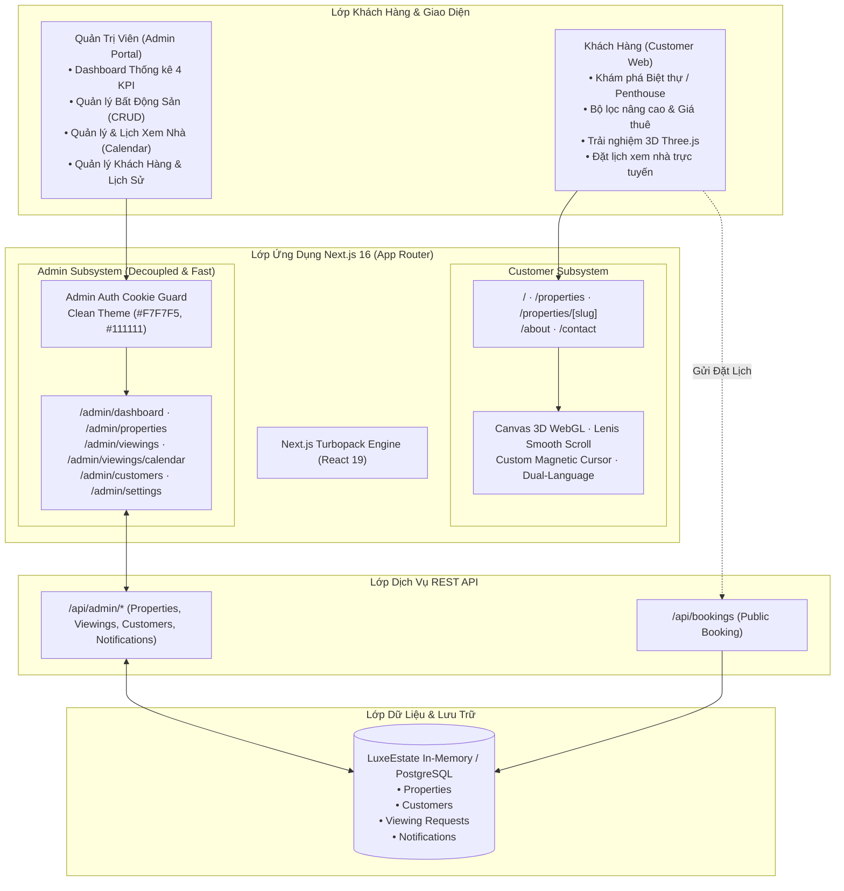

# LuxeEstate — Trung Tâm Tài Liệu Hệ Thống (Documentation Hub)

Chào mừng bạn đến với kho tài liệu kỹ thuật và vận hành chính thức của nền tảng **LuxeEstate — Luxury Real Estate Rental Platform**. Toàn bộ tài liệu được chuẩn hóa theo chuẩn kỹ thuật phần mềm quốc tế, phục vụ cho Software Architects, Developers, DevOps Engineers, QA/Testers và Quản trị viên hệ thống.

---

## 📌 Thông Tin Dự Án Trực Tuyến

* **Production Website (Customer & Admin):** [https://luxury-estate-self.vercel.app](https://luxury-estate-self.vercel.app)
* **Admin Portal Login:** [https://luxury-estate-self.vercel.app/admin/login](https://luxury-estate-self.vercel.app/admin/login)
  * *Tài khoản Quản trị viên Demo:* `admin@luxeestate.vn` / `admin123` (Có nút 1-click đăng nhập nhanh)
* **GitHub Repository:** [liliustwocout/luxe-estate](https://github.com/liliustwocout/luxe-estate)

---

## 📚 Danh Mục Tài Liệu Hệ Thống

Tài liệu được chia thành 7 chuyên đề bài bản và chuyên sâu:

| STT | Tài Liệu | Mô Tả Trọng Tâm | Đối Tượng Phù Hợp |
| :--- | :--- | :--- | :--- |
| **01** | [**01_ARCHITECTURE.md**](./01_ARCHITECTURE.md) | Kiến trúc tổng thể, mô hình C4 Container, chiến lược Decoupling (Customer Web vs Admin), Stack công nghệ Next.js 16 / React 19 / Three.js / Tailwind CSS v4. | Software Architects, Senior Developers |
| **02** | [**02_REQUIREMENTS_SPEC.md**](./02_REQUIREMENTS_SPEC.md) | Đặc tả yêu cầu phần mềm (SRS), phân tích phạm vi 100% cho thuê (Rental-focused), 3 trụ cột Admin, quy trình nghiệp vụ & phi chức năng. | Product Managers, QA, BA |
| **03** | [**03_API_REFERENCE.md**](./03_API_REFERENCE.md) | Đặc tả toàn diện các RESTful API (Public Bookings, Admin Properties, Viewings, Customers, Notifications), Schemas, mã lỗi & payloads. | Frontend & Backend Engineers |
| **04** | [**04_DATABASE_SCHEMA.md**](./04_DATABASE_SCHEMA.md) | Thiết kế cơ sở dữ liệu quan hệ, sơ đồ ERD, thực thể, khóa ngoại, DDL Script PostgreSQL đầy đủ và Prisma Schema migration. | Data Architects, Database Admins |
| **05** | [**05_USER_GUIDE.md**](./05_USER_GUIDE.md) | Sổ tay vận hành: Hướng dẫn trải nghiệm khách hàng và quy trình vận hành chi tiết cho Quản trị viên (Duyệt lịch, Calendar, BĐS, Khách hàng). | End-Users, Operations, Support |
| **06** | [**06_DEPLOYMENT_DEVOPS.md**](./06_DEPLOYMENT_DEVOPS.md) | Hướng dẫn triển khai Vercel Production, quy trình CI/CD GitHub, kịch bản kiểm thử tự động Playwright và giám sát hiệu năng. | DevOps, SRE, QA Engineers |
| **07** | [**07_DEVELOPMENT_ONBOARDING.md**](./07_DEVELOPMENT_ONBOARDING.md) | Cẩm nang Onboarding lập trình viên: Cài đặt môi trường, quy chuẩn code React 19/Next.js 16, cấu trúc thư mục, hệ thống State & Song ngữ. | Lập trình viên mới, Developers |

---

## 🗺️ Bản Đồ Kiến Trúc Tổng Thể (System Architecture Map)

---

## 💡 Triết Lý Thiết Kế: "Hai Thế Giới Tối Ưu"

Hệ thống được thiết kế dựa trên sự phân tách trải nghiệm rõ ràng:

1. **Khách hàng ngoài (Customer Facing):**
   * **Mục tiêu:** *Thuyết phục, Sang trọng, Đẳng cấp (WOW Factor)*.
   * **Đặc trưng:** Nền tối huyền bí, điểm nhấn vàng hoàng gia, không gian 3D Three.js tương tác hạt bụi ánh sáng, chữ lớn nghệ thuật, hiệu ứng cuộn mượt mà với Lenis và con trỏ từ tính.
2. **Khu vực quản trị (Admin Portal):**
   * **Mục tiêu:** *Tốc độ, Chuẩn xác, Tối giản, Năng suất cao (Fast, Clear, Efficient)*.
   * **Đặc trưng:** Nền sáng `#F7F7F5`, thẻ Card `#FFFFFF` bo góc tinh tế, Sidebar đen `#111111` thanh lịch, **tách biệt 100%** khỏi các thư viện đồ họa 3D/Canvas nặng để đạt tốc độ phản hồi tức thì (< 50ms).

---

## 🚀 Đọc Tiếp Theo Vai Trò (Recommended Reading Paths)

* **Nếu bạn là Lập trình viên mới tham gia dự án:**
  Bắt đầu từ [07_DEVELOPMENT_ONBOARDING.md](./07_DEVELOPMENT_ONBOARDING.md) $\rightarrow$ [01_ARCHITECTURE.md](./01_ARCHITECTURE.md) $\rightarrow$ [03_API_REFERENCE.md](./03_API_REFERENCE.md).
* **Nếu bạn là Quản lý sản phẩm (PM/BA):**
  Bắt đầu từ [02_REQUIREMENTS_SPEC.md](./02_REQUIREMENTS_SPEC.md) $\rightarrow$ [05_USER_GUIDE.md](./05_USER_GUIDE.md).
* **Nếu bạn phụ trách Cơ sở dữ liệu & Hạ tầng:**
  Bắt đầu từ [04_DATABASE_SCHEMA.md](./04_DATABASE_SCHEMA.md) $\rightarrow$ [06_DEPLOYMENT_DEVOPS.md](./06_DEPLOYMENT_DEVOPS.md).
